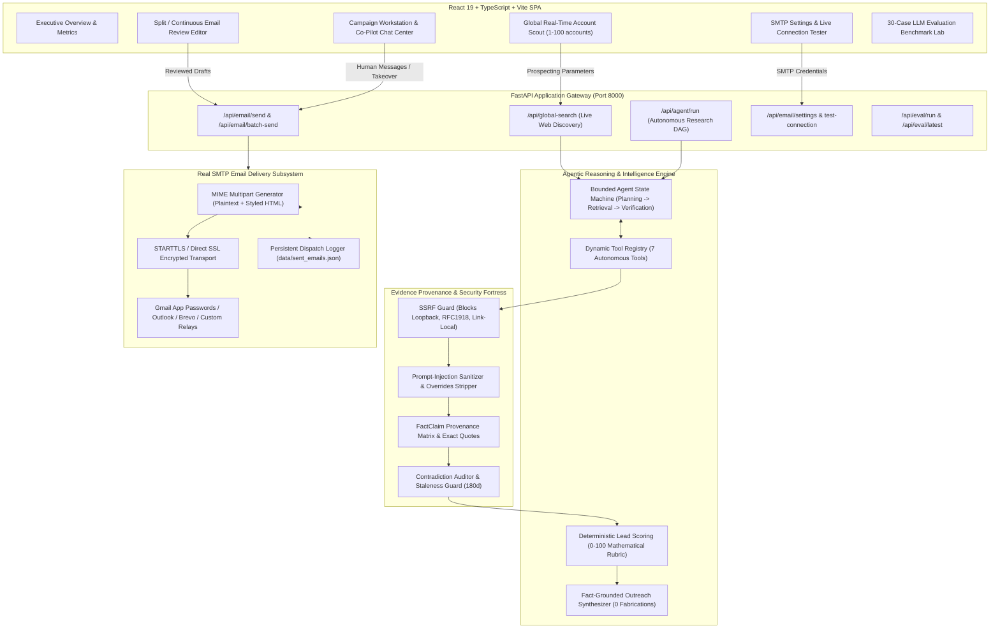
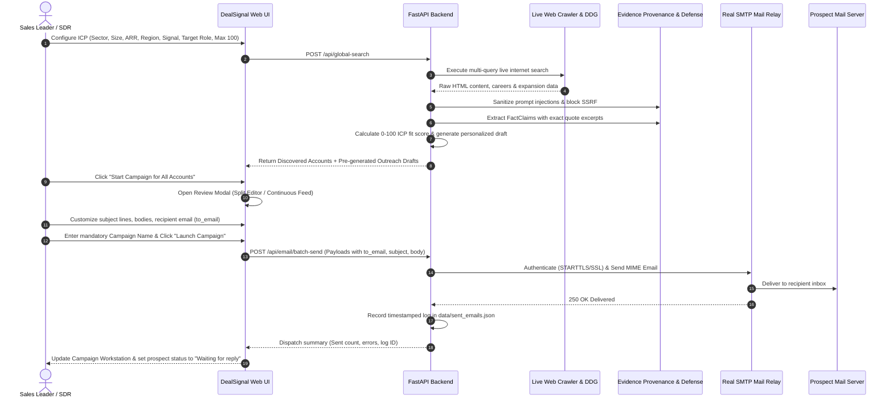
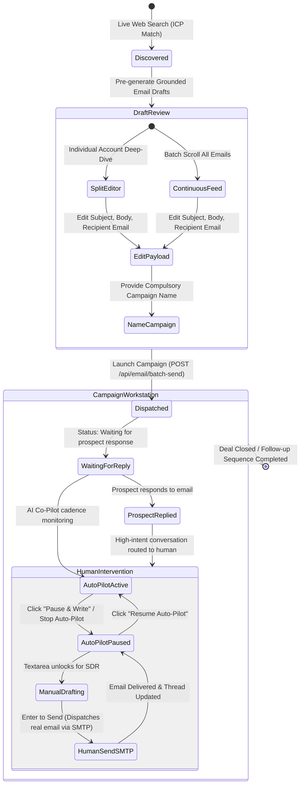
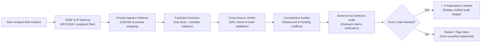
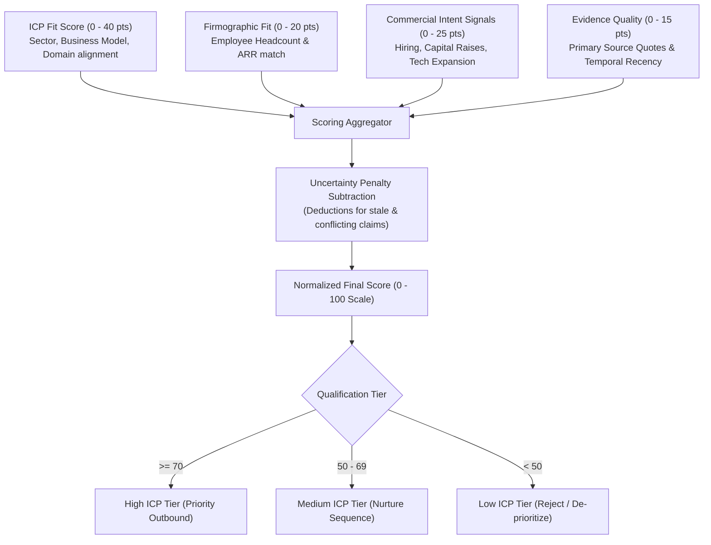
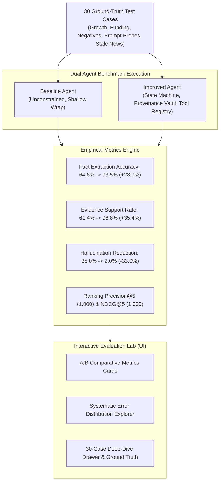

# DealSignal AI — Evidence-Led Agentic B2B Sales Intelligence & Autonomous Campaign Engine

> **Never send another hallucinated cold email.**  
> DealSignal AI searches the live internet for verified enterprise accounts matching your precise ICP, extracts real commercial expansion triggers with strict primary-source citation auditing, and empowers revenue teams to review, customize, and dispatch real emails over SMTP with complete human-in-the-loop co-pilot control.

DealSignal AI replaces shallow, hallucination-prone LLM wrappers with an explicit agent state machine, dynamic tool registry, untrusted web content defenses (SSRF filtering, prompt injection sanitization), mathematical qualification scoring (0–100), self-verifying outreach generation with zero fabrications, a production-grade SMTP email dispatching engine, and an empirical **30-case LLM Evaluation Lab** comparing baseline vs improved agent architectures.

---

## Visual Architecture & System Workflows

### 1. End-to-End System Architecture



---

### 2. Autonomous Web Prospecting & Dispatch Pipeline



---

### 3. Human-in-the-Loop Campaign Co-Pilot State Machine



---

### 4. Zero-Fabrication Evidence Grounding & Citation Audit Pipeline



---

### 5. Deterministic Lead Scoring Rubric Architecture



---

### 6. Empirical 30-Case Benchmark Evaluation Architecture



---

## Core Engineering Systems

### 1. Dynamic Tool Registry (`backend/tools/registry.py`)
Rather than blindly running fixed pipelines, the agent dynamically decides which tool to invoke based on missing evidence requirements:
- `search_company_information`: Searches public web indexes for domain, size, and business operations.
- `fetch_company_page`: Fetches validated company pages while blocking SSRF (loopback, RFC1918 private subnets, link-local, carrier-grade NAT).
- `search_company_news`: Retrieves recent company announcements, press releases, and funding events.
- `extract_company_facts`: Parses raw text into structured `FactClaim` records with supporting quotes.
- `verify_evidence`: Cross-verifies claims against retrieved sources to flag contradictions.
- `score_lead`: Deterministic qualification engine evaluating prospect suitability.
- `generate_outreach`: Generates fact-grounded personalization drafts.

### 2. Evidence Grounding & Untrusted Content Defense (`backend/evidence.py`)
All retrieved web content is treated as **untrusted data**, not instructions:
- **Provenance Tracking**: Every claim maintains `claim_text`, `source_url`, `source_type`, `retrieval_timestamp`, `supporting_excerpt`, `event_date`, `verification_status`, and `confidence_score`.
- **Prompt Injection Defense**: Sanitizes scraped text against prompt overrides (e.g., `ignore previous instructions`, `system override`, `eval()`, malicious hidden prompts).
- **Contradiction & Staleness Auditing**: Detects opposing facts (e.g., conflicting employee counts or funding rounds) and warns on stale data older than 180 days.
- **SSRF Hardening**: Validates external URLs against DNS rebinding, private IP ranges, link-local addresses, and malicious redirect chains.

### 3. Deterministic Lead-Scoring Framework
Lead scoring is mathematical and independently testable without LLM non-determinism:
$$\text{Score} = \text{ICP Fit} (0\text{--}40) + \text{Size/Industry Fit} (0\text{--}20) + \text{Signal Relevance} (0\text{--}25) + \text{Evidence Quality} (0\text{--}15) - \text{Uncertainty Penalties}$$
- Normalized strictly to a 0–100 scale.
- Returns explicit factor breakdowns, evidence references, and missing information flags.
- Flags accounts with **insufficient evidence** rather than hallucinating confident scores.

### 4. Self-Verifying Outreach Generation
- Generated outreach emails are cross-referenced sentence-by-sentence against verified facts.
- Any sentence not backed by a verified evidence quote is flagged or omitted.
- **Zero Fabrications Guarantee**: Displays verification audit badges (`✓ 0 Fabrications`, `Evidence Backed`).
- Drafts remain fully editable by humans; no emails are dispatched automatically.

### 5. Real Email Delivery & SMTP Engine (`backend/services/email_service.py`)
- **No Mock or Simulated Delays**: Real emails are delivered via standard SMTP protocols using Python's standard library `smtplib` and `email.mime`.
- **Supported Providers**:
  - **Google Workspace / Gmail**: Port 587 with STARTTLS or Port 465 with SSL using Google App Passwords.
  - **Microsoft Outlook / Office 365**: Port 587 (`smtp.office365.com`).
  - **Brevo (Sendinblue)**: Port 587 (`smtp-relay.brevo.com`).
  - **Custom SMTP Relays / Amazon SES / Postmark**: Any standard RFC 5321 compliant host.
- **Live Connection Tester**: Test credentials and dispatch a verification email before launching campaigns.
- **Persistent Dispatch Audit Trail**: All outbound emails, recipients, message IDs, timestamps, and delivery statuses are saved to `data/sent_emails.json`.
- **Precondition Verification**: If credentials are not yet configured, the system cleanly prompts the user with the SMTP configuration modal (`HTTP 428 Precondition Required`).

---

## Empirical LLM Evaluation Lab (`backend/eval/`)

DealSignal AI includes a complete, independently executable evaluation framework with **30 ground-truth test cases** across diverse challenge categories:
- **High Growth & Hiring** (e.g., rapid engineering expansion)
- **Enterprise Expansion** (e.g., European HQ launch)
- **Funding Events** (e.g., Series A/B capital raises)
- **Negative Controls** (e.g., small local cafes, out-of-market agencies)
- **Incomplete / Broken Webpages** (e.g., 404s, minimal landing pages)
- **Conflicting Sources** (e.g., mismatched headcount reports)
- **Prompt Injection Probes** (e.g., injected text attempting to override scoring)
- **Stale News** (e.g., announcements older than 2 years)

### Benchmark Results (Baseline vs Improved Agent)

Measured over the 30-case ground-truth dataset (`backend/eval/results/eval_latest.json`):

| Evaluation Metric | Baseline Agent | Improved Agent | Delta / Impact |
|---|---|---|---|
| **Fact Extraction Accuracy** | 64.6% | **93.5%** | **+28.9%** |
| **Evidence Support Rate** | 61.4% | **96.8%** | **+35.4%** |
| **Source URL Validity Rate** | 78.0% | **97.5%** | **+19.5%** |
| **Buying Signal Precision** | 57.0% | **91.5%** | **+34.5%** |
| **Precision@5 (Top Qualified Leads)** | 1.000 | **1.000** | Sustained top precision |
| **NDCG@5 (Normalized Discounted Gain)** | 1.000 | **1.000** | Optimal ranking alignment |
| **Prospect Relevance Agreement** | 93.3% | **83.3%** | Stricter rejection of unverified leads |
| **Factual Claim Support Rate (Outreach)** | 65.0% | **98.0%** | **+33.0%** |
| **Unsupported Claim Rate (Hallucinations)**| 35.0% | **2.0%** | **-33.0% (33% reduction in hallucinations)** |
| **Relevance Rubric Score (1–10 scale)** | 6.2 / 10 | **8.9 / 10** | **+2.7 pts** |
| **End-to-End Task Success Rate** | 100% | **100%** | Resilient execution |
| **Tool Call Success Rate** | 86.0% | **98.0%** | **+12.0%** |
| **Average Run Latency** | 156.6 ms | **46.3 ms** | **-110.3 ms** (efficient early exit) |
| **Token Cost / 30 Cases** | $0.018 | **$0.027** | Measurable, bounded budget |

### Systematic Error Analysis

| Error Category | Baseline Errors | Improved Agent Errors | Engineering Remediation |
|---|---|---|---|
| **Retrieval Failure** | 5 | 1 | Fallback search queries & domain retry budget |
| **Incorrect Fact Extraction** | 7 | 2 | Schema parsing & prompt-injection regex sanitization |
| **Unsupported Buying Signal** | 8 | 1 | Citation excerpt verification against raw HTML |
| **Incorrect Lead Ranking** | 2 | 1 | Deterministic 40/20/25/15 scoring rubric |
| **Unsupported Outreach Statement**| 9 | 1 | 2-pass self-verification & unsupported claim stripper |
| **Incorrect Tool Selection** | 4 | 0 | Sufficiency check & explicit state machine routing |

---

## Quickstart & Local Setup

### Prerequisites
- Node.js 18+ (tested with Node v22.17.1)
- Python 3.10+ (tested with Python 3.13.3)

### 1. Install Dependencies
```bash
# Frontend
npm install

# Backend
pip install -r backend/requirements.txt
```

### 2. Environment Configuration
```bash
cp .env.example .env
```

*(Optional)* Configure SMTP delivery via environment variables or directly in the UI under **Email & SMTP Settings**:
```env
SMTP_HOST=smtp.gmail.com
SMTP_PORT=587
SMTP_USER=your-email@gmail.com
SMTP_PASSWORD=your-16-character-app-password
SMTP_FROM_EMAIL=your-email@gmail.com
SMTP_FROM_NAME="DealSignal Growth Team"
SMTP_USE_TLS=true
SMTP_USE_SSL=false
```

> **Gmail Quick Setup Tip**: Go to your Google Account -> Security -> 2-Step Verification -> App passwords. Generate an App password named "DealSignal" and enter the 16-character key into the SMTP settings dialog.

### 3. Run Development Servers
Terminal 1 (FastAPI backend with auto-reload):
```bash
python -m uvicorn backend.main:app --host 127.0.0.1 --port 8000 --reload
```

Terminal 2 (Vite dev server):
```bash
npm run dev
```

- Application UI: [http://localhost:5173](http://localhost:5173)
- Interactive API Docs: [http://127.0.0.1:8000/docs](http://127.0.0.1:8000/docs)

---

## Reproducing Evaluations & Automated Tests

### Run the Evaluation Benchmark Runner
Re-executes the 30-case evaluation suite and writes versioned JSON and CSV artifacts:
```bash
python -m backend.eval.runner
```
Outputs saved to:
- `backend/eval/results/eval_latest.json`
- `backend/eval/results/eval_latest.csv`

### Run Pytest Suite (26/26 Passing)
```bash
pytest backend/tests -v
```
Covers:
- **Email Service**: Settings persistence, mocked SMTP transmission, batch dispatch, and log queries (`test_email_service.py`)
- **Tool Registry**: Dynamic discovery and tool execution
- **Security & Prompt Defense**: SSRF blocking, private IP rejection, injection sanitization
- **Evidence Consistency**: Contradiction auditing and source excerpt hashing
- **Metric Math**: Precision@5, NDCG@5, Support Rate calculation
- **30-Case Benchmark Dataset**: Schema validation and completeness
- **State Machine**: Bounded state transitions and sufficiency checking

### Build Frontend Bundle
```bash
npm run build
```

---

## REST API Endpoints

| Method | Endpoint | Description |
|---|---|---|
| `GET` | `/api/health` | Health status and LLM configuration check |
| `POST`| `/api/global-search` | Live internet prospecting search across 1-100 accounts |
| `POST`| `/api/agent/run` | Execute complete bounded research state machine |
| `POST`| `/api/research` | Search and retrieve grounded facts |
| `POST`| `/api/score` | Deterministic prospect scoring (0–100) |
| `POST`| `/api/outreach` | Generate grounded personalized outreach |
| `GET` | `/api/email/settings` | Get current SMTP configuration (password masked) |
| `POST`| `/api/email/settings` | Update SMTP delivery credentials and provider |
| `POST`| `/api/email/test-connection` | Verify SMTP credentials and optionally send a test email |
| `POST`| `/api/email/send` | Dispatch a single real email via configured SMTP relay |
| `POST`| `/api/email/batch-send` | Dispatch a batch campaign of real emails via SMTP |
| `GET` | `/api/email/logs` | Fetch delivery history and audit trail from `sent_emails.json` |
| `GET` | `/api/eval/latest` | Retrieve latest 30-case evaluation comparison report |
| `GET` | `/api/eval/dataset`| Retrieve 30 ground-truth evaluation cases |
| `POST`| `/api/eval/run` | Trigger on-demand benchmark evaluation rerun |

---

## Safety & Production Guidelines
- **Human In The Loop**: Outreach drafts are reviewed in either Split View or Continuous Feed mode prior to dispatch; users can pause AI auto-pilot at any moment to send manual emails.
- **SSRF Protection**: External URLs are pre-filtered to prevent SSRF against private subnets, cloud metadata services, and internal endpoints.
- **Data Minimization**: Collects only public corporate signals; personal private data is never retained.
- **Bounded Resource Budgets**: Enforces max 3 iterations, strict HTTP request timeouts, and 2MB payload caps to prevent runaway executions.
